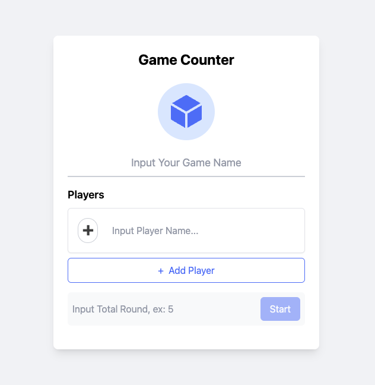

# Game Counter App

The **Game Counter App** is a web-based application designed to help you keep track of scores for various games. Built with React, TypeScript, and Tailwind CSS, this app is ideal for casual game nights or competitive events where keeping accurate scores is essential.

## Features

- **Add and Customize Players**: Add new players and customize their names with ease.
- **Track Points**: Select players and increment their points with a single click.
- **Round Progress**: Visual progress bar indicating the current round in relation to the total phases.
- **Responsive UI**: Optimized for both desktop and mobile devices.
- **Dynamic Winner Announcement**: At the end of the game, the app announces the winner(s) and displays a congratulatory message.
- **Interactive UI Elements**: Highlights the selected player and ensures seamless interactions throughout.

## Technologies Used

- **React**: For building the user interface.
- **TypeScript**: To enhance code reliability and maintainability.
- **Tailwind CSS**: For quick and efficient styling.
- **Heroicons**: For modern and responsive icons.

## Demo

Check out the live demo of the app [here](https://game-counter-phi.vercel.app).

## How to Run Locally

1. Clone the repository:
   ```bash
   git clone https://github.com/yourusername/game-counter-app.git
   ```
2. Navigate to the project directory:
   ```bash
   cd game-counter-app
   ```
3. Install dependencies:
   ```bash
   npm install
   ```
4. Start the development server:
   ```bash
   npm start
   ```
5. Open your browser and go to `http://localhost:3000` to view the app.

## Screenshots



## License

This project is licensed under the MIT License.

## Contributions

Contributions are welcome! Please submit a pull request or open an issue to discuss potential changes.

---

Enjoy using the **Game Counter App** for all your game tracking needs!
